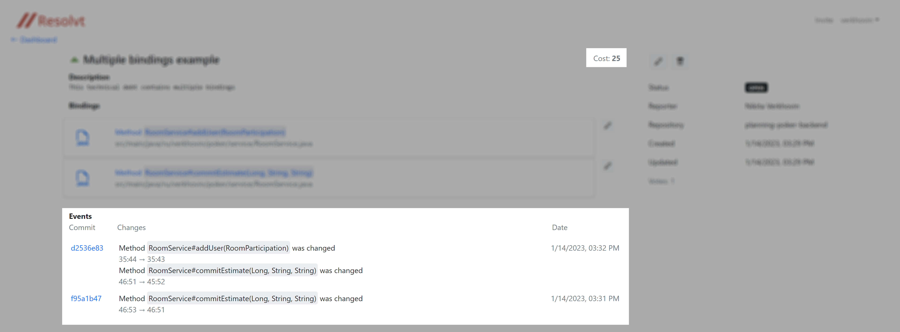
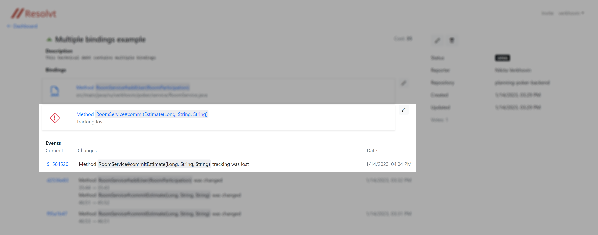

# Getting Started with Resolvt

> **NOTE:** This guide assumes that you either have Resolvt self-hosted on your server or using [resolvt.dev](https://resolvt.dev).
>

<!-- no toc -->
- [Intruduction to Resolvt and its features](#intruduction-to-resolvt-and-its-features)
- [Setting up](#setting-up)
  - [Creating workspace](#creating-workspace)
  - [Installing the plugin](#installing-the-plugin)
    - [Intellij IDEA](#intellij-idea)
  - [Inviting the teammates](#inviting-the-teammates)
- [Using Resolvt](#using-resolvt)
  - [Reporting tecnical debt](#reporting-tecnical-debt)
  - [Tracking changes and technical debt costs](#tracking-changes-and-technical-debt-costs)

## Intruduction to Resolvt and its features
**Resolvt** is an open source tool for managing technical debt. It acts as an issue tracker, allowing developers to create tickets associated with specific code entities, such as functions, methods, and classes. By integrating with source code repositories, Resolvt can track changes to these code entities and calculate the cost of unresolved technical debt. With Resolvt, developers can easily report and track technical debt tickets within their IDE, making it easier to maintain and improve their code.

Some of the benefits of using Resolvt include:

* Improved code quality and maintenance
* Easier tracking and management of technical debt
* Ability to prioritize technical debt tickets relying on its cost

Resolvt supports the Java and Kotlin programming languages and is compatible with IntelliJ IDEA throug **Resolvt Integration** plugin. It also integrates with GitHub and Bitbucket as source code repository providers.

## Setting up
### Creating workspace
Before starting using Resolvt you should set up a workspace for your team. To do that:

1. Navigate to Resolvt and sign in using the source code repository provider of your choice. If you are using Resolvt on-premise Resolvt, instance is most probably configured to use single source code repository provider prefered by your organisation. In this case you may be automatically redirected to GitHub/Bitbucket authorization confirmation page.
2. After sign up you will be redirected to main Resolvt dashboard. If you are not part of any workspace the dashboard will be empty and will suggest you to **Connect** Resolvt to your code repositories. You can either click **Connect** or **Create workspace** at the top right corner of the page.
3. You will be redirected to your source repository provider (GitHub or Bitbucket). You will be asked to choose the account/organisation/repositories you want Resolvt to have access to.
> **Note:** Unfortunately Resolvt for Bitbucket is not listed in Atlassian Marketplace yet, that's why you will need to enable development mode for your Bitbucket Cloud workspace to connect Resolvt to it. If it is the case for you Bitbucket will show you a corresponding warning:
> 
> 

> 
> 

> 

### Installing the plugin
The IDE plugin is required to create technical debt tickets. It also provides the possibility to browse and edit tickets within a project.

#### Intellij IDEA
Install the Resolvt Integration plugin from the  <a href="https://plugins.jetbrains.com/plugin/20735-resolvt-integration" target="_blank">JetBrains Marketplace</a>.

> Alternatively, in your IDE go to **File > Settings > Plugins > Marketplace** tab. Search for "Resolvt" and install the "Resolvt Integration" plugin.

After the plugin is installed, in the IDE:

1. Go to **Settings > Tools > Resolvt**.
2. In the **Advanced** section, enter the URL of your Resolvt instance in the **Host** field. If you are not using a self-hosted version, leave this field as is.
3. Click **Connect to Resolvt**. You will be redirected to Resolvt, where you will be prompted to enter an authorization code if you are logged in.
4. In the settings dialog, enter the authorization code in the **Code** field and click **Ok**.
5. If the connection is successful, you will see the **Logged as ...** label in the settings dialog.

<video src="media/getting-started/plugin-setup.mp4" controls></video>

### Inviting the teammates
To invite team members to the workspace:

1. Go to the web dashboard and click **Invite** in the top-right corner
2. Enter the email address of your new team member
3. Click **Send invitation**

> **NOTE:** The user you are trying to invite to the workspace must be signed up to Resolvt instance.

<video src="media/getting-started/invite.mp4" controls></video>

## Using Resolvt
### Reporting tecnical debt
When workspace is set up in Resolvt and the pluging is installed to your IDE and connected to Resolvt instance you can report your first technical debt ticket.
To do that:

1. Open Java or Kotlin file in your project.
2. Find a method/function or class you think should be marked as a technical debt
3. Right click -> **Add Debt Binding (Repot Debt)**
4. Choose one of possible binding options
5. _[Optional] Add more bindings repeating the steps 1-3_
6. Enter ticket title and description in the tool window
7. Click **Submit**

<video src="media/getting-started/report.mp4" controls></video>

Example above shows that technical debt tickets can be associated with (bound to) specific code entites. You can bind technical debt ticket to an unlimited amount of:
- Classes and methods in Java
- Classes and functions in Kotlin 

While creating or editing a technical debt ticket in your IDE you can add more then one bindings the same way as it is described above. 

### Tracking changes and technical debt costs
Technical debt cost refers to the impact of technical debt on the team performance and code wellbeing. 

Resolvt tracks changes to your code and identifies those that occur in code that is bound to technical debt tickets. As a result, the cost is increased when code bound to a technical debt ticket is modified, or when a user upvotes a technical debt ticket. This cost is meant to reflect the additional time, resources, and potential revenue loss associated with maintaining and fixing the problem caused by the technical debt. By tracking the cost, Resolvt can help prioritize technical debt tickets and make decisions on when to address the technical debt.

In some cases the tracking of a technical debt binding can be lost. That, for example, can happen if the method/function or class that was bound to the technical debt ticket was removed.

Bindings which tracking was lost are displayed in the technical debt ticket in a special way:

In some cases, that means the technical debt is no longer applicable (as the code was removed or refactored) and the technical debt ticket can be resolved. You can do it manually using the **Edit** button in the web UI. Alternatively, you can edit the ticket by removing the binding or creating a new one within the IDE.