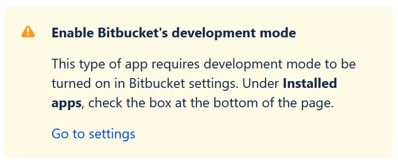

# Getting Started with Resolvt

> **NOTE:** This guide assumes that you either have Resolvt self-hosted on your server or using the cloud version (TBD).
>

## Intruduction to Resolvt and its features
**Resolvt** is an open source tool for managing technical debt. It acts as an issue tracker, allowing developers to create tickets for specific code entities, such as functions, methods, and classes. By integrating with source code repositories, Resolvt can track changes to these code entities and calculate the cost of unresolved technical debt. With Resolvt, developers can easily report and track technical debt tickets within their IDE, making it easier to maintain and improve their code.

Some of the benefits of using Resolvt include:

* Improved code quality and maintenance
* Easier tracking and management of technical debt
* Ability to prioritize technical debt tickets relying on its cost

Resolvt supports the Java and Kotlin programming languages and is compatible with IntelliJ IDEA throug **Resolvt Integration** plugin. It also integrates with GitHub and Bitbucket as source code repository providers.

## Setting up Resolvt workspace
Before starting using Resolvt you should set up a workspace for your team. To do that:

1. Navigate to Resolvt and sign in using the source code repository provider of your choice. If you are using Resolvt on-premise Resolvt instance is most probably configured to use single reporisotry prefered by your organisationl. In this case you may be automatically redirected to GitHub/Bitbucket authorization confirmation page.
2. After sign up you will be redirected to main Resolvt dashboard. If you are not part of any workspace the dashboard will be empty and will suggest you to **Connect** Resolvt to your code repositories. You can either click **Connect** or **Create workspace** at the top right corner of the page.
3. You will be redirected to your source repository provider (GitHub or Bitbucket). You will be asked to choose the account/organisation/repositories you want Resolvt to have access to.
> **Note:** Unfortunately Resolvt for Bitbucket is not listed in Atlassian Marketplace yet, that's why you will need to enable development mode for your Bitbucket Cloud workspace to connect Resolvt to it. If it is the case for you Bitbucket will show you a corresponding warning:
> 
> 

> 
> 

> 

## Inviting the teammates

To invite team members to the workspace:

1. Go to the web dashboard and click **Invite** in the top-right corner
2. Enter the email address of your new team member
3. Click **Send invitation**

> **NOTE:** The user you are trying to invite to the workspace must be signed up to Resolvt instance.

<video src="media/getting-started/invite.mp4" controls></video>